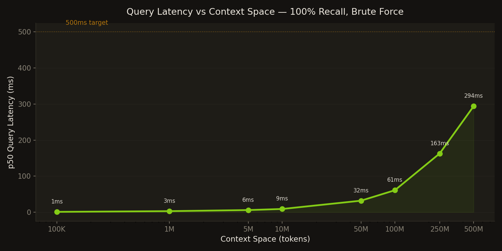

```
 __  __                                                _
|  \/  | ___ _ __ ___   ___  _ __ _   _ _ __   ___  _ __| |_
| |\/| |/ _ \ '_ ` _ \ / _ \| '__| | | | '_ \ / _ \| '__| __|
| |  | |  __/ | | | | | (_) | |  | |_| | |_) | (_) | |  | |_
|_|  |_|\___|_| |_| |_|\___/|_|   \__, | .__/ \___/|_|   \__|
                                   |___/|_|
   Destroyer of the context window
```

Memoryport gives LLMs persistent, queryable memory using [Arweave](https://arweave.com) for permanent storage and [LanceDB](https://lancedb.com) for local vector search. Every conversation, document, and knowledge artifact is stored permanently and retrieved semantically — so your AI never forgets.

Works with **Claude Code**, **Cursor**, **Open WebUI**, **Ollama**, and any OpenAI-compatible tool.

## Performance



**294ms query latency at 500M tokens** — brute force with 100% recall. No approximate indexing needed.

| Context Space | Chunks | p50 Latency |
|---|---|---|
| 100K tokens | 266 | 1ms |
| 1M tokens | 2,666 | 3ms |
| 10M tokens | 26,666 | 9ms |
| 100M tokens | 266,666 | 61ms |
| 500M tokens | 1,333,333 | 294ms |

Tested with `nomic-embed-text` (768d, local via Ollama). Compacted LanceDB, no cloud APIs required.

## Install

```bash
curl -fsSL https://raw.githubusercontent.com/t8/memoryport/main/install.sh | sh
```

Then run the setup wizard:
```bash
uc init
```

That's it. Restart your editor — Memoryport auto-captures conversations and surfaces relevant context.

Also available via:
```bash
brew install memoryport/tap/uc     # Homebrew
npx @memoryport/cli init           # npm
```

### Build from Source

```bash
# Prerequisites: Rust 1.91+, protoc (brew install protobuf), Node.js 18+
cargo build --release
cd ui && pnpm install && pnpm build  # Dashboard
```

## Supported Integrations

| Tool | Method | Setup |
|------|--------|-------|
| **Claude Code** | API Proxy | `uc init` configures automatically (sets `ANTHROPIC_BASE_URL`) |
| **Cursor** | API Proxy | Set `ANTHROPIC_BASE_URL=http://127.0.0.1:9191` |
| **Open WebUI** | Ollama Proxy | Set Ollama URL to `http://127.0.0.1:9191` in Settings → Connections |
| **Ollama (terminal)** | Ollama Proxy | `OLLAMA_HOST=http://127.0.0.1:9191 ollama run llama3` |
| **Continue.dev** | Ollama/OpenAI Proxy | Set endpoint to `http://127.0.0.1:9191` |
| **Any OpenAI SDK app** | API Proxy | `OPENAI_BASE_URL=http://127.0.0.1:9191` |
| **Claude Code (MCP)** | MCP Server | `uc init` registers MCP automatically |
| **Cursor (MCP)** | MCP Server | `uc init` registers MCP automatically |

The proxy handles all three API formats on a single port (9191):
- **Anthropic** `/v1/messages`
- **OpenAI** `/v1/chat/completions`
- **Ollama** `/api/chat`, `/api/generate`, `/api/tags`, and all `/api/*` routes

## How It Works

Memoryport supports two retrieval modes, configurable per-request:

### Single-turn (default)

```
User sends a message
  │
  ▼
Proxy intercepts transparently
  │
  ├─ Quality gating (skip greetings, commands, trivial queries)
  ├─ Search memory for relevant context
  ├─ Inject context into the message as plain text
  ├─ Forward to LLM (Anthropic, OpenAI, Ollama)
  ├─ Capture user message + assistant response
  │   ├─ Sanitize (strip system prompts, internal commands)
  │   ├─ Embed and store in LanceDB
  │   └─ Optionally sync to Arweave (permanent storage)
  └─ Return response to user
```

### Multi-turn (agentic retrieval)

```
User sends a message
  │
  ▼
Proxy injects a memory search tool into the request
  │
  ├─ LLM decides what to search for and calls the tool
  ├─ Proxy executes the search, returns results to LLM
  ├─ LLM may search again (up to max_rounds)
  ├─ LLM produces final response with full context
  ├─ Capture and store conversation
  └─ Return response to user
```

Multi-turn lets the model iteratively refine its memory queries — useful for complex questions that need multiple pieces of context. Toggle between modes in the dashboard Settings or via `[proxy.agentic] enabled` in config. See the [AMP specification](https://github.com/t8/amp-spec) for the protocol details.

## Dashboard

Memoryport includes a React dashboard for visualizing your stored memories:

```bash
# Start the API server + proxy + dashboard
uc-server --config ~/.memoryport/uc.toml    # API on :8090
uc-proxy --config ~/.memoryport/uc.toml     # Proxy on :9191
cd ui && pnpm dev                            # Dashboard on :5174
```

**Pages:**
- **Dashboard** — status cards, session browser, semantic search with keyword highlighting
- **Analytics** — activity sparklines, storage growth, type/source distribution, memory density heatmap, sync status
- **Integrations** — toggle MCP server, API proxy, Ollama capture on/off. Real controls that write config and start/stop services.
- **Settings** — embedding provider, model, API key, smart gating, encryption, Arweave wallet

Also available as a Tauri desktop app (macOS/Windows/Linux).

## CLI

```bash
uc init                  # Interactive setup wizard
uc store "text" -t knowledge  # Store a chunk
uc query "search term"   # Full retrieval pipeline (gated + reranked + assembled)
uc retrieve "search"     # Raw vector search (bypasses gating)
uc proxy                 # Start the API proxy
uc delete --tx-id <id>   # Logical deletion (destroy encryption key)
uc rebuild-index -u <id> # Rebuild index from Arweave
uc status                # Index stats
uc flush                 # Flush pending writes
```

## MCP Tools

| Tool | Description |
|------|-------------|
| `uc_auto_store` | Silently store a conversation turn (called automatically) |
| `uc_store` | Store text with explicit metadata |
| `uc_query` | Semantic search with full retrieval pipeline |
| `uc_retrieve` | Raw ranked results |
| `uc_get_session` | Full conversation history for a session |
| `uc_list_sessions` | List all stored sessions |
| `uc_status` | System status |

## Configuration

`~/.memoryport/uc.toml` (created by `uc init`):

```toml
[arweave]
gateway = "https://arweave.net"
turbo_endpoint = "https://upload.ardrive.io"
# wallet_path = "~/.memoryport/wallet.json"

[index]
path = "~/.memoryport/index"
embedding_dimensions = 768

[embeddings]
provider = "ollama"              # or "openai"
model = "nomic-embed-text"
dimensions = 768

[retrieval]
max_context_tokens = 50000
similarity_top_k = 50
recency_window = 20
gating_enabled = true            # Three-gate system: skip greetings, route by embedding, filter low quality
# query_expansion = true         # LLM generates alternative search terms
# hyde = true                    # Embed hypothetical answer instead of raw query
# llm_model = "gpt-4o-mini"

[encryption]
# enabled = true
# passphrase_env = "UC_MASTER_PASSPHRASE"

[proxy]
listen = "127.0.0.1:9191"
```

## Architecture

```
crates/
├── uc-arweave/      # Arweave client (wallet, ANS-104, Turbo, GraphQL)
├── uc-embeddings/   # Embedding + LLM providers (OpenAI, Ollama)
├── uc-core/         # Core engine (chunk, index, retrieve, rerank, assemble, encrypt, gate)
├── uc-cli/          # CLI binary with setup wizard
├── uc-mcp/          # MCP server (stdio, 7 tools, 2 resources)
├── uc-proxy/        # Multi-protocol API proxy (Anthropic + OpenAI + Ollama)
├── uc-server/       # Multi-tenant hosted API server + dashboard
└── uc-tauri/        # Tauri desktop app

ui/                  # React dashboard (Vite + Tailwind)
```

## Security

- All data on Arweave is encrypted with AES-256-GCM (per-batch random keys)
- Master key derived from passphrase via Argon2id
- Logical deletion: destroy batch key → ciphertext permanently unreadable
- API keys: 128-bit entropy, SHA-256 hashed, stored in SQLite
- Proxy sanitizes system prompts, internal commands, and meta-requests before storage

## Deployment

### Docker

```bash
docker compose up
```

Environment variables:
- `OPENAI_API_KEY` — for embeddings (if using OpenAI)
- `UC_ADMIN_API_KEY` — admin API key for user management
- `UC_SERVER_LISTEN` — listen address (default `0.0.0.0:8080`)
- `UC_SERVER_DATA_DIR` — data directory (default `/var/lib/uc-server`)

### Hosted API

```bash
# Create a user
curl -X POST http://localhost:8080/admin/users \
  -H "Authorization: Bearer $UC_ADMIN_API_KEY" \
  -H "Content-Type: application/json" \
  -d '{"email": "user@example.com"}'
# Returns: { "user_id": "...", "api_key": "uc_..." }

# Store context
curl -X POST http://localhost:8080/v1/store \
  -H "Authorization: Bearer uc_..." \
  -H "Content-Type: application/json" \
  -d '{"text": "Arweave uses pay-once permanent storage", "chunk_type": "knowledge"}'

# Query
curl -X POST http://localhost:8080/v1/query \
  -H "Authorization: Bearer uc_..." \
  -H "Content-Type: application/json" \
  -d '{"query": "How does Arweave pricing work?"}'
```

## Benchmarks

### LongMemEval (ICLR 2025)

Evaluated on [LongMemEval](https://github.com/xiaowu0162/LongMemEval), a benchmark for long-term memory in chat assistants. 500 curated questions across multi-session conversation histories.

**Session Recall** (did retrieval find the correct session?):

| Category | Recall | n |
|----------|--------|---|
| knowledge-update | **100%** | 8 |
| multi-session | **100%** | 8 |
| single-session-user | **100%** | 8 |
| single-session-assistant | **100%** | 8 |
| single-session-preference | **100%** | 8 |
| temporal-reasoning | **87.5%** | 8 |
| **Overall** | **97.9%** | **48** |

For context, GPT-4o with naive RAG scores 30-70% on this benchmark.

Tested with `nomic-embed-text` (768d, local via Ollama). No cloud APIs required.

### Stress Test (10K chunks)

| Metric | Result |
|--------|--------|
| Insert throughput | 25 chunks/sec (1K) → 13 chunks/sec (10K) |
| Retrieval accuracy | 91% recall@10 across 6 topic categories |
| Query latency (p50) | 265ms (1K chunks), 361ms (oracle dataset) |
| Index size | ~50MB at 10K chunks |

### Three-Gate Retrieval Gating

Prevents unnecessary retrieval on simple messages:

| Gate | What it does | Latency |
|------|-------------|---------|
| Gate 1: Rules | Skip greetings, commands, short queries. Force memory references, temporal queries. | ~0ms |
| Gate 2: Embedding routing | Compare query embedding against "needs retrieval" vs "skip" centroids. | ~0ms (reuses existing embedding) |
| Gate 3: Quality threshold | Drop results below relevance score. | ~0ms (checks existing scores) |

### Proxy Latency Overhead

Measures the latency added by the proxy in each mode using a mock upstream (50ms simulated LLM delay):

| Mode | p50 | p95 | mean | Overhead vs direct |
|------|-----|-----|------|--------------------|
| Direct (no proxy) | 58ms | 61ms | 58ms | — |
| Single-turn (context injection) | 108ms | 120ms | 107ms | +49ms |
| Multi-turn (agentic loop, 1 round) | 139ms | 145ms | 139ms | +81ms |

Single-turn overhead is dominated by embedding + LanceDB search. Multi-turn adds one extra round trip to the upstream for tool execution.

Run benchmarks yourself:
```bash
python3 tests/stress/generate.py --chunks 10000
python3 tests/stress/benchmark.py
python3 tests/longmemeval/run_benchmark.py --questions 50 --dataset oracle

# Latency benchmark (requires mock upstream + proxy pointed at it)
python3 tests/latency/mock_upstream.py --port 8199 &
# Set upstream = "http://127.0.0.1:8199" in uc.toml, then start proxy on port 9292
python3 tests/latency/benchmark.py --proxy http://127.0.0.1:9292 --mock http://127.0.0.1:8199
```

## Data Recovery

If you lose your local data or set up on a new machine, Pro users can rebuild their memory from Arweave:

1. Install Memoryport on the new machine
2. Open Settings → Arweave Storage
3. Enter your API key
4. Click "Rebuild from Arweave"

All encrypted batches are fetched from the permanent storage network and re-indexed locally. Your encryption key never leaves your machine — data is decrypted client-side during rebuild.

## License

Apache-2.0
